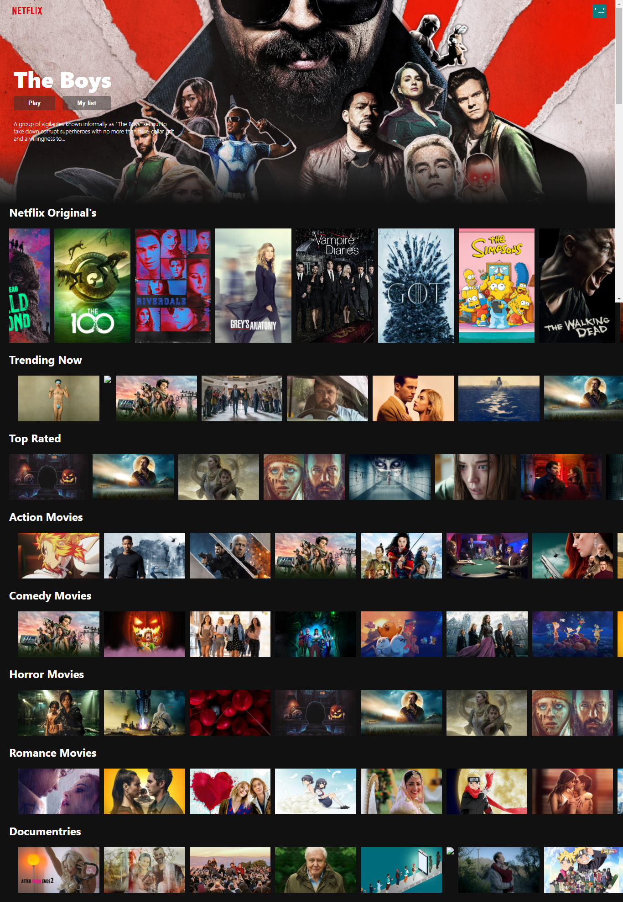

# Netflix Clone FrontEnd 

[Visit site](https://netflix-clone681.netlify.app/)
> ### Technologies used

- React JS
- HTML5
- CSS3
- Javascript
- JSX

> ### API's

- TMDB (The movie database) - API
> ### Libraries
- React-Youtube (Library)
- Movie-trailer (Library)
- Axios (Library for fetching api)

---

> ### Screenshots

## 

---

> ## How use

```
$ git clone
$ npm install
$ npm start
```
